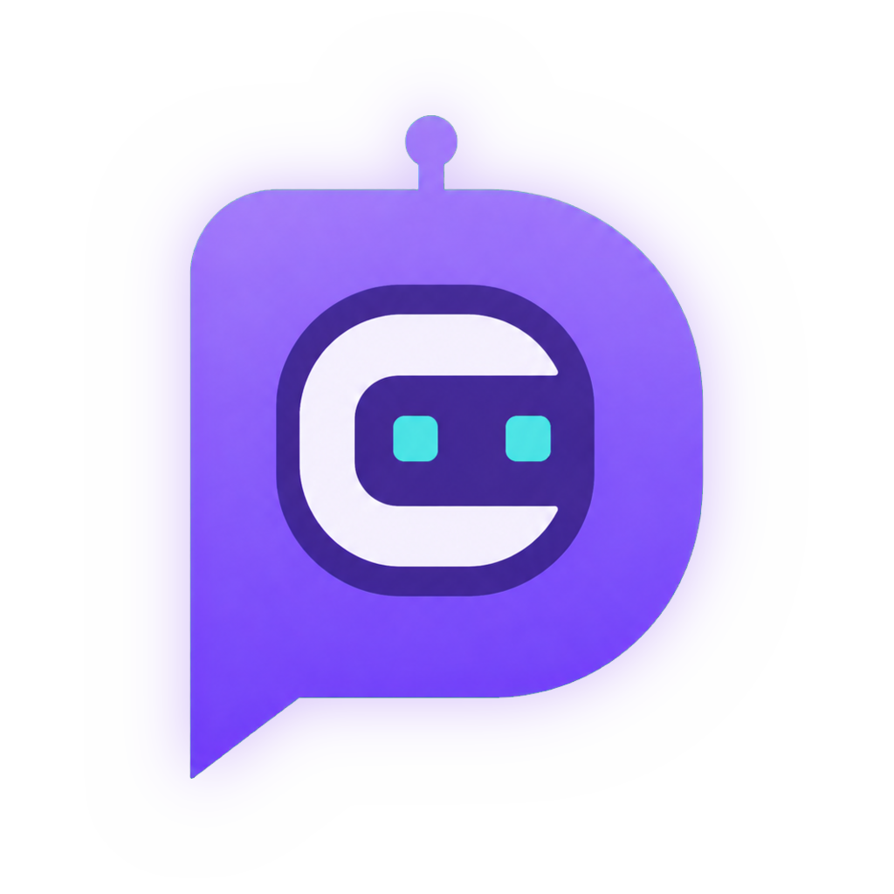

<div align="center">

  <!-- Replace 'assets/logo.png' with your actual logo path once uploaded -->
  

  # Data Convo
  
  **100% self-hosted. Docker-first. Deploy securely on your own infrastructure with zero data retention.**

  Data Convo turns your database into an AI-ready semantic layer — offering Chat-to-SQL, BI dashboards, and anomaly detection — powered entirely by your own BYOK LLM keys (no platform API key fallback).

  [](https://www.dataconvo.app)
  [](https://www.python.org/)
  [](https://www.docker.com/)

</div>

---

> **Want to test it out instantly?** 
> Explore the live workspace right now at 👉 **[dataconvo.app](https://www.dataconvo.app)**.

---

## 💎 Core Capabilities

* **🤖 Chat-to-SQL & Semantic Layer:** Bridge business users and complex relational databases. Transform natural language into precise, production-grade database queries instantly.
* **📊 Interactive BI Dashboards:** Go beyond simple text outputs by generating dynamic dashboards and visual metrics straight from your conversation workspace.
* **🔍 Autonomous Anomaly Detection:** Let your data intelligence layer surface unusual trends, traffic spikes, or outlier metrics automatically.
* **🛡️ Universal BYOK (Bring Your Own Key):** Securely plug in your own OpenAI, Anthropic, OpenRouter, or Gemini keys. Every LLM call uses your encrypted keys with zero platform fallback or data interception.
* **🔒 Zero Data Retention Architecture:** Because Data Convo is built Docker-first for your own infrastructure, your database schemas, user workspaces, and query data never leave your direct control.

---


# Data Convo · Self-Hosted Enterprise Semantic Layer

> **100% self-hosted. Docker-first.** Deploy securely on your own infrastructure
> with zero data retention. Data Convo turns your database into an AI-ready
> semantic layer — Chat-to-SQL, BI dashboards, and anomaly detection — powered
> entirely by **your own BYOK LLM keys** (no platform API key fallback).

---

## 🐳 Prerequisites

- **Docker** (≥ 20.10) — [install](https://docs.docker.com/get-docker/)
- **Docker Compose** v2 (bundled with Docker Desktop, or
  [standalone](https://docs.docker.com/compose/install/))
- **An LLM API key** (BYOK): OpenAI, Anthropic, OpenRouter, Google Gemini,
  or any OpenAI-compatible endpoint. This is **required** — there is no
  platform key fallback.

---

## 🚀 Quick Start (3 Steps)

### Step 1 — Get the code

```bash
git clone <your-repo-url> dataconvo
cd dataconvo
```

*(If you received the app as a folder archive, just cd into that folder.)*

### Step 2 — Configure `.env` with BYOK & secrets

```bash
cp .env.example .env
```

Edit `.env` and set at minimum:

| Variable | Purpose | Example |
| --- | --- | --- |
| `FLASK_SECRET_KEY` | Session signing secret (generate: `python -c "import secrets; print(secrets.token_hex(32))"`) | `f3b6…random hex` |
| `LICENSE_SIGNING_SECRET` | **Must match** the secret your license vendor used to sign your key | `f3b6…random hex` |
| `OPENAI_API_KEY` | Your BYOK OpenAI key (or `OPENROUTER_API_KEY` / `ANTHROPIC_API_KEY`) | `sk-…` |
| `PORT` | Host port (default `8000`) | `8000` |

> 💡 **LICENSE_SIGNING_SECRET matters.** Your license key was HMAC-signed with
> the vendor's secret. If this value differs, activation will reject the key.

### Step 3 — Start

```bash
docker compose up -d --build
```

Open **http://localhost:8000** (or `http://<your-server>:${PORT}`).

---

## 👑 First Super Admin & License Activation

1. **Sign up** at http://localhost:8000/signup — the **first account** created
   becomes the workspace **Super Admin**.
2. Go to **Account → 🔑 License & Subscription**.
3. Paste the **license key** you received (from your Data Convo vendor) into
   **Activate License** and click **💾 Activate License**.

   The key is verified **locally** (HMAC-SHA256, no phone-home) and is bound to
   your admin email. The correct tier (Community / Team / Enterprise) and seat
   limits are applied immediately.

4. **Configure BYOK** (if not already): **Account → 🔐 Security → BYOK** — add
   your OpenAI / Anthropic / OpenRouter key. Queries will not run without it.

---

## 🔄 Updating

Data persists in the named Docker volume (`dataconvo_data`), so your users,
workspaces, semantic models, and license state survive every update.

```bash
docker compose pull && docker compose up -d
```

That's the exact upgrade command — configuration and data are preserved.

---

## 🔑 Issuing Customer Licenses (Vendor / Internal CLI)

Generate HMAC-SHA256 signed license keys bound to a customer's admin email:

```bash
python generate_key.py --email client@company.com --tier team --months 12
python generate_key.py --email admin@acme.io --tier enterprise        # no expiry
```

The output is a copy-paste friendly box with the license key and summary:

```
┌─────────────────────────────────────────────────────────────┐
│ LICENSE KEY                                                  │
│                                                              │
│ DCCONVO-ORSWC3JOMFSG22LOIB4C42LPFYYTOOBXGM2DMMRXGQ-5f90d…   │
└─────────────────────────────────────────────────────────────┘
```

- `--tier` : `community` (1 member) · `team` (15 members) · `enterprise` (unlimited)
- `--months` : licence duration in calendar months; omit for non-expiring

**Important:** the CLI and the customer's deployment must share the same
`LICENSE_SIGNING_SECRET`, otherwise activation will reject the key.

---

## 📂 Persistent Data & Volume

`docker-compose.yml` binds the internal metadata database
(SQLite at `/app/data/dataconvo.db`) to the named volume `dataconvo_data`.

```yaml
volumes:
  - dataconvo_data:/app/data
```

Everything that matters — users, workspaces, published semantic models,
RBAC table permissions, license state — lives on that volume and survives
`docker compose pull && docker compose up -d`.

To back it up:

```bash
docker run --rm -v dataconvo_data:/data -v "$PWD":/backup alpine \
  tar czf /backup/dataconvo_data_$(date +%F).tgz -C /data .
```

---

## 📋 Environment Variables (`.env.example`)

| Variable | Required | Description |
| --- | --- | --- |
| `FLASK_SECRET_KEY` | ✅ | Flask session secret |
| `LICENSE_SIGNING_SECRET` | ✅ | HMAC secret that verifies your license keys |
| `PORT` | — | Host/container port (default `8000`) |
| `DATABASE_URL` | — | Defaults to SQLite in the named volume; set Postgres URI to override |
| `OPENAI_API_KEY` / `OPENROUTER_API_KEY` / `ANTHROPIC_API_KEY` | ✅ (one) | BYOK LLM provider key — no platform fallback |
| `STRIPE_TEAM_PAYMENT_LINK` | — | Stripe Payment Link for the Team tier on `/pricing` |
| `SUPABASE_URL` / `SUPABASE_ANON_KEY` | — | Optional Supabase auth |
| `GOOGLE_CLIENT_ID` / `GOOGLE_CLIENT_SECRET` | — | Optional Google OAuth |
| `SMTP_*` | — | SMTP for workspace invite emails |
| `VERSION_CHECK_URL` | — | Remote JSON feed for the in-app update banner |
| `APP_VERSION` | — | Deployed release version shown in the UI |

---

## 🧰 Useful Commands

```bash
# Startup
docker compose up -d --build

# Update (data preserved)
docker compose pull && docker compose up -d

# Logs
docker compose logs -f app

# Stop
docker compose down

# Full stop + remove container (data volume is KEPT)
docker compose down --remove-orphans
```

---

## 🔒 Security Notes

- **Zero data retention** — your schema and query results live only in your
  session on your server.
- **BYOK-only** — every LLM call uses your own encrypted key; no sponsored
  fallback, no third-party ingestion.
- **MFA by default** — first admin and all invited members enroll TOTP 2FA.
- **RBAC** — per-table and per-column permissions enforced server-side.
- License keys are verified locally with HMAC-SHA256 — activation works fully
  offline on your infrastructure.
